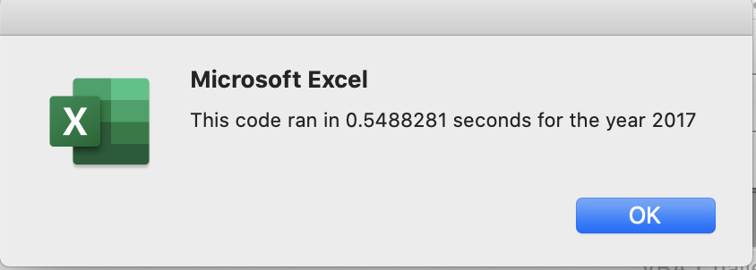
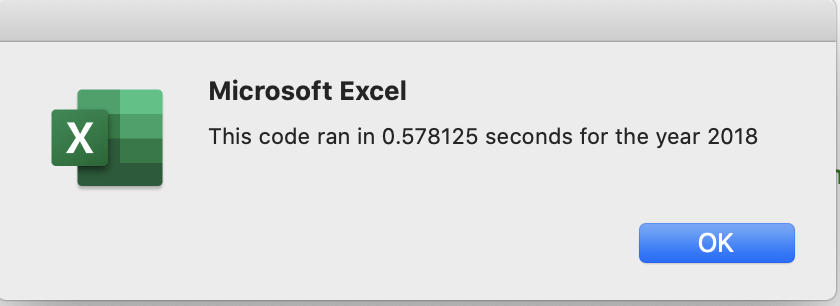
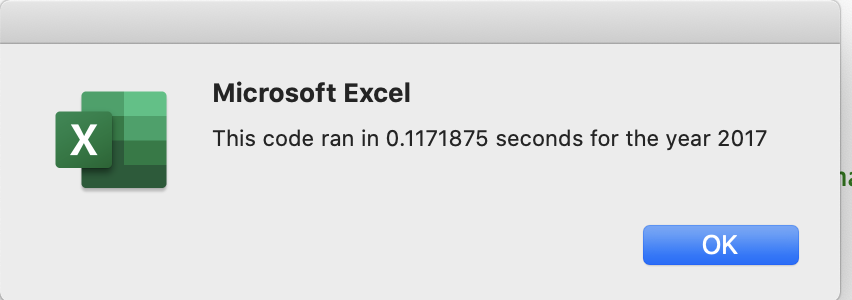
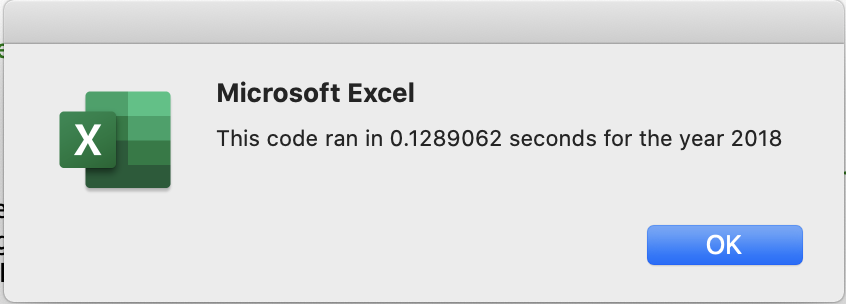
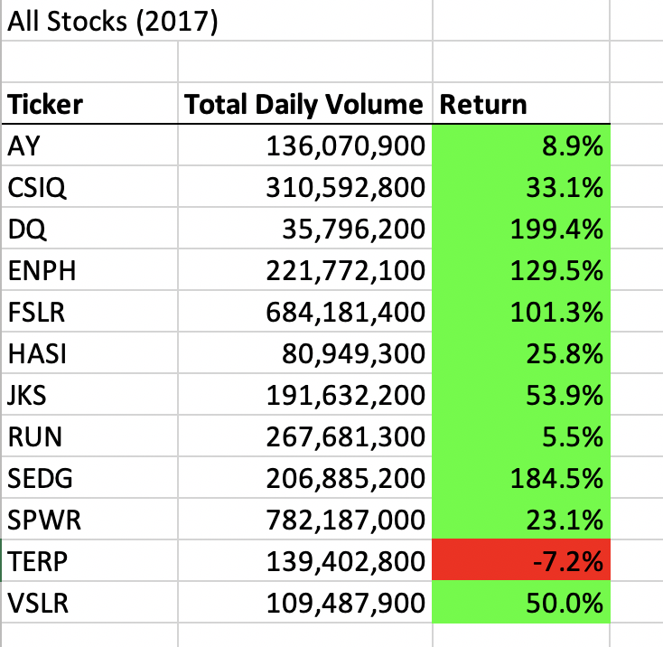
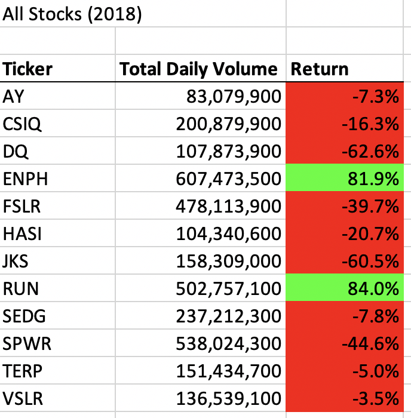
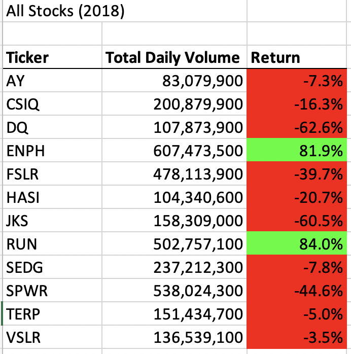

# Optimization of Stock Ticker Symbols Analysis Program

## Background

In this project, we will analyze the performance of various stocks in the years 2017 and 2018. In addition, we will write the code in a manner so it runs fast for very large data sets for future analyses.

The performance of a given stock ticker symbol is computed by its annual return using the formula below:

```
Rate of return in percent = 100 x ((final price/starting price) - 1)
```

## Data Input and Processing

### Data Input

Data is provided as rows in a spreadsheet for two years (2017 and 2018). There are 3012 total rows. Each row corresponds to a distinct ticker symbol. Each row corresponds to a specific day of the year and consists of the following columns:

* Open value
* High value
* Low value
* Close value
* Total volume traded

For the purposes of our analyses, we are interested only in the following:

* Close value
* Total volume traded.

In total, there are a total of twleve distinct tickers. There are two assumptions we made in this code:

* First, we didn't explicitly count the ticker symbols. It could have been possible to loop over all rows, and determine the distinct tickers first in a separate macro.
* Second, data was presented in a way so that rows corresponding to a given ticker symbol were contiguous. In real time, it is not unreasonable to assume data would be interspersed, and to make it contiguous in a manner required by our code would be a resource intensive activity. In reality, we do not require data to be present in this manner. This representation only simplified our code for the purposes of this class.

### Processing - First Attempt (Naive)

In the first attempt, we looped over the data twelve separate times, once for each ticker symbol. The code is in the given *AllStocksAnalysis()* macro. For each ticker symbol, we added up the volumes from each row and kept track of the start and end prices. The overall structure of the code is as follows:

```
For each ticker:
  For each row:
    If this is the first row for this ticker:
      cache Start Price
    If this is the last row for this ticker:
      cache End Price
      --> Possible optimization we did not do: Break out of the loop right here.
    If this is a row for this ticker:
      Add up volume
  Dump start price, end price and volume for this ticker
 
Format the output
```

In reality, this code could have easily been optimized by simply breaking out of the loop once a new ticker symbol was discovered. This optimization would make a difference to the running time as we would break out the loop early for earlier tickers, but the gains would marginally diminish towards the later tickers. For the very last ticker, we would still end up scanning the whole spreadsheet.

### Processing - Second Attempt (Optimized)

We make an observation that it is unnecessary to loop over all rows more than once. We can simply create arrays where a specific array index corresponds to a given ticker symbol. In our code, we would track which index corresponds to which ticker. This way, when scanning the spreadsheet, as we detect a new ticker symbol, we simply move to the next array index. Now, our *for loops* are reversed - the outer *for loop* would scan the rows and the inner loop would track the ticker index. The structure of the code looks like below:

```
Initialize ticker index to 0

For each row:
  If this is the first row for this ticker:
    cache Start Price
  If this is the last row for this ticker:
    cache End Price
    increase ticker index by 1
  If this is a row for this ticker:
    Add up volume
   
Dump start price, end pruce and volumes for all tickers
Format output
```

Also notice that the dumping of all information for a ticker occurs outside of both loops, since this information is cached in a specified index of the respective arrays.

## Results

We executed the original code and the optimized code for both 2017 and 2018. The table below shows the running times for case case and shows the obvious improvement for the optimized code. This optimization will become crucial when the number of ticker symbols becomes large.

|       | 2017 | 2018 | 
| ----- | ---- |------|
| Naive |  |  |
| Optimized |  |  |

To prove that the optimization is functionally correct, we wimply compare the output from running the two programs. If the outcome is identical, we can say with high confidence that the optimization is indeed functionally correct. Note that this does not definitely prove the correctness of the optimization algorithm and it is possible that we might have to do more due diligence in practice.

In our case, the table below shows that the output from running the two programs is identical.

|       | 2017 | 2018 | 
| ----- | ---- |------|
| Naive |  |  |
| Optimized | .png) |  |


